  

  
  

---

**`Sobre mim`**
Sou um estudante de **Análise e Desenvolvimento de Sistemas** de 21 anos. Estou focado em aprender tecnologias modernas e boas práticas de programação, como **TypeScript** e os pilares da **POO**, para me tornar um profissional de excelência.

---

**`Tecnologias e Interesses`**

  

---

**`Atividade e Consistência`**

  

---

**`Estatísticas Gerais`**

  
  

---

  

